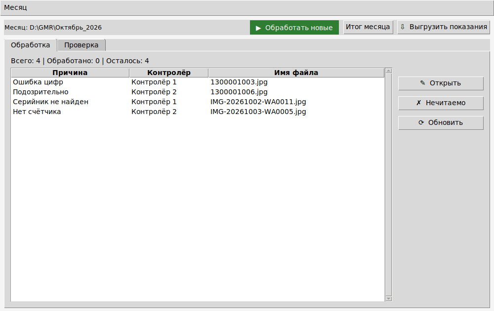
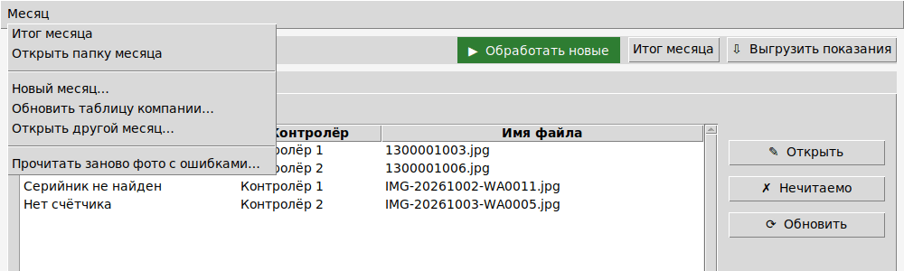
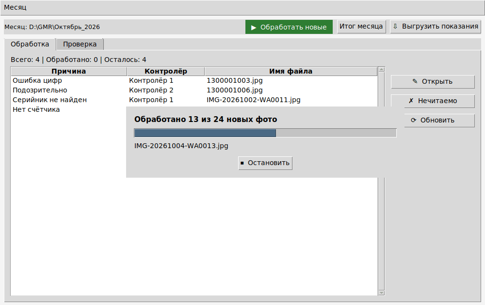
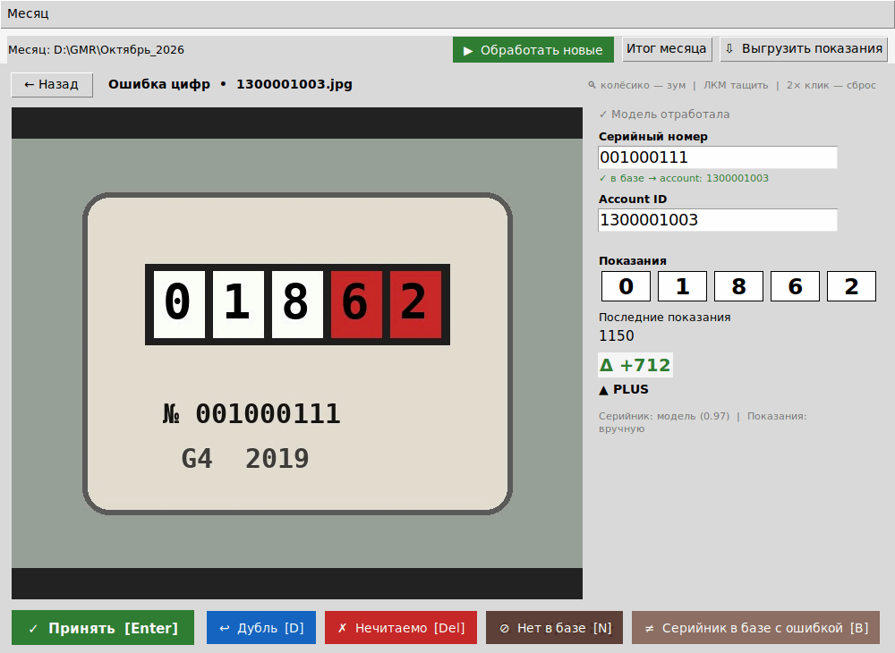
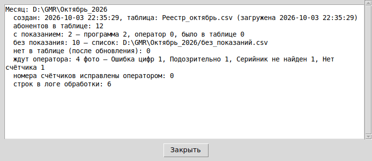

# Инструкция оператора

Программа читает показания газовых счётчиков по фото контролёров. Что она
не смогла прочитать сама, вы разбираете в окне. За месяц PowerShell не нужен.
Снимки экрана сделаны на выдуманных данных.

## Как открыть программу

Двойной щелчок по ярлыку **«Счётчики»** на рабочем столе.

Если ярлыка нет, его один раз создаёт владелец программы: в PowerShell, в
папке программы, команда `python gmr.py shortcut`.

При первом запуске окно спросит ваше имя и **папку месяца**: «Открыть…» —
месяц уже есть, «Новый месяц…» — создать его из таблицы компании (как ниже).

## В начале месяца

1. Меню **«Месяц» → «Новый месяц…»**.
2. Выберите таблицу компании (`.xls`, `.xlsx` или `.csv`) — как её прислали.
3. Окно, как при «Сохранить как», предложит имя папки — название месяца,
   например `Октябрь_2026`, рядом с прошлым месяцем. Нажмите «Сохранить»:
   папку программа создаст сама.
4. Окно покажет **настройки распознавания** — они уже заполнены как в
   прошлом месяце. Их выбирает владелец программы; если он не сказал
   иначе, просто нажмите «Дальше».
5. Окно покажет отчёт загрузки: сколько абонентов, какие номера счётчиков
   повторяются и т. п. Нажмите «Закрыть» — окно уже работает с новым месяцем.

Если в таблице уже есть показания, окно спросит, очистить ли их. **«Да»** —
месяц начинается без показаний, программа прочитает все фото; **«Нет»** —
эти показания считаются уже записанными. Оригинал таблицы не меняется
(копия — в папке месяца, `таблицы\`).

Если рядом с таблицей лежит старый лог программы, окно спросит, переносить
ли его. Обычно отвечайте **«Нет»**.

## Каждый день

1. **Положите новые фото** из WhatsApp в папку месяца:
   `фото\<контролёр>\`. Меню «Месяц» → «Открыть папку месяца» откроет её.
   - У каждого контролёра своя папка: `фото\Аюб\`, `фото\Сулиман С\`…
   - Прямо в `фото\` фото не кладите — программа попросит разложить их по
     папкам.
   - Старые фото не удаляйте и не переносите: программа сама помнит, что
     уже разобрано, и второй раз их не читает.
2. **Нажмите «▶ Обработать новые».** Появится полоса «Обработано N из M
   новых фото». Пока она идёт, разбирать фото нельзя. «Остановить» —
   программа дочитает текущее фото и закончит; остальные прочитает
   следующий запуск. В конце окно покажет итог обработки.

   

3. **Разберите очередь** на вкладке «Обработка». Это фото, которые
   программа не смогла прочитать сама. В столбце «Контролёр» видно, чьё фото.
   Двойной щелчок по строке открывает фото:

   

   Проверьте серийный номер, лицевой счёт и 5 цифр показания и нажмите:
   - **«Принять» [Enter]** — показание верное. Если у счёта уже есть
     показание, окно покажет его и спросит «Заменить?».
   - **«Дубль» [D]** — повтор счётчика, который уже прочитан.
   - **«Нечитаемо» [Del]** — по фото показание не прочитать.
   - **«Нет в базе» [N]** — счётчика нет в таблице компании. Если компания
     потом добавит его в таблицу, программа прочитает фото сама.
   - **«Серийник в базе с ошибкой» [B]** — на фото номер верный, а в таблице
     компании опечатка. Номер исправится в базе месяца, показание
     запишется, номер попадёт в список для компании `db_serial_fix.csv`.

   После каждого действия сразу открывается следующее фото. «← Назад» —
   вернуться к списку.
4. Время от времени — вкладка **«Проверка»**: фото, которые программа
   прочитала сама. «Верно» [Enter] или «Исправить» [E].

## Если компания прислала обновлённую таблицу

Меню **«Месяц» → «Обновить таблицу компании…»** и выберите новый файл.
Показания, которые уже записаны, сохраняются. Новые абоненты добавляются,
пропавшие помечаются «нет в таблице».

## В конце месяца

1. **«Итог месяца»**: сколько показаний записано, сколько абонентов без
   показания, сколько фото ждут разбора.

   

2. Отдайте компании файл **`показания.xlsx`** из папки месяца. Он
   обновляется после каждой обработки, по кнопке «⇩ Выгрузить показания» и
   при закрытии окна. Список абонентов без показания — `без_показаний.csv`
   там же.
3. Следующий месяц — снова «Месяц» → «Новый месяц…» и новая папка.

## Если что-то не так

| Что видно | Что делать |
|---|---|
| «Файл открыт в Excel: показания.xlsx» | Закройте файл в Excel и нажмите «Повторить» (или «Выгрузить показания» ещё раз). Показания при этом не теряются — они в базе месяца |
| «Обработка не удалась» и текст про фото без папки контролёра | В `фото\` лежат фото без папки. Разложите их по папкам контролёров и снова «Обработать новые» |
| В итоге обработки «⚠ Не взяты …» | Эти файлы программа не читает (не `.jpg`/`.png` или папка внутри папки контролёра). Если это фото — сохраните его как `.jpg` |
| «Ошибка программы» | Сообщите владельцу программы. Подробности — в файле `program2.log` в папке программы (если окно открыто ярлыком) |
| После замены модели нужно перечитать старые фото с ошибками | Меню «Месяц» → «Прочитать заново фото с ошибками…» |
